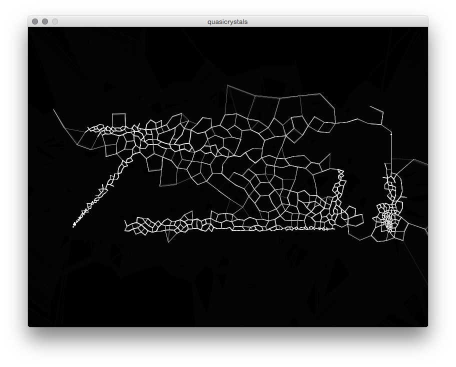

# Quasicrystals

Growing 'quasicrystals' responding to positional key presses.
Developed as a responsive projection in collaboration with theatre group Divadlo Fi.



## Controls

### Cursor movement

Currently the horizontal controls are mapped to:
```
1,2,3,4,5,6,7,8,9 (left to right)
```

and the vertical controls to:
```
q,a (top, bottom)
```

### Camera movement

zoom in and out with:
```
+, -
```

move camera up, down, left and right with:
```
↑,↓,←,→
```


## Credits

This sketch is based on [https://www.openprocessing.org/sketch/137534/](https://www.openprocessing.org/sketch/137534/)
